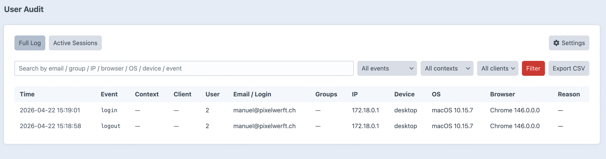
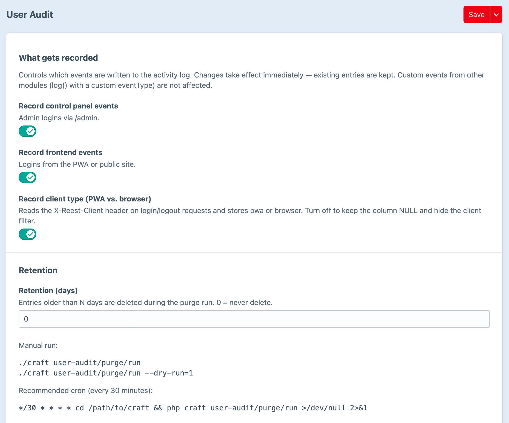

# User Audit for Craft CMS

[](https://packagist.org/packages/pixelwerft/user-audit)
[](https://craftcms.com/)
[](https://php.net/)
[](LICENSE.md)

Audit log for user activity in Craft: login, logout, failed logins, session
expiries and arbitrary custom events. Captures IP, device type, operating
system, browser, client type (PWA vs. browser) and group membership snapshot
at login time.

Written for operators who need to answer questions like *who logged in when,
from where, on what device, as member of which groups, and did anyone try to
break in?* — without stitching it together from three different log files.

## Features

- **Automatic events**: `login`, `logout`, `login_failed`, `login_blocked`,
  `session_expired`, `password_changed`, `impersonation_started`,
  `impersonation_stopped` — logged via Craft's `EVENT_AFTER_LOGIN` /
  `EVENT_BEFORE_LOGOUT` / `EVENT_LOGIN_FAILURE` and the User
  `BEFORE_SAVE` / `AFTER_SAVE` hooks.
- **Session lifecycle & duration** (v2.3): each login is issued a
  server-side session id linking it to its matching logout row, so the
  logout carries the session duration. A session-overview page
  (`/user-audit/session/<id>`) shows every row that shared one session.
- **Impersonation logging** (v2.3): records when an admin steps into
  another user's account (`impersonation_started`, with the
  impersonator id) and when they step back out (`impersonation_stopped`).
- **Suspicious-activity score** (v2.3): every genuine login is scored
  0–5 from five signals (new location, unusual hour, new device, recent
  failures, IP reputation). The score and its active signals are stored
  on the row; the Logs index offers a "Suspicious only" filter and a
  per-row risk badge.
- **User self-service view** (v2.3): a logged-in user can review their
  own history at `user-audit/my-activity` (CP and front end), plus an
  embeddable snippet for customer sites.
- **Custom events API**: other modules/plugins can write their own event types
  into the same table (`property_exported`, `user_locked`, ...).
- **Per-row metadata**:
  - IP address
  - User agent (stored raw)
  - Parsed device type, OS (name + version), browser (name + version)
  - Context: `cp` (Craft control panel) or `fe` (frontend)
  - Client: `pwa` (if the `X-Reest-Client: pwa` header is sent) or `browser`
  - User groups snapshot (comma-separated handles at login time)
  - Free-form JSON metadata column for custom event payloads
- **Control-panel viewer**: two-page layout split into *Logs* and *Monitor*,
  plus a per-user drilldown.
  - **Logs**: searchable / filterable / sortable index with debounced live
    filter (from 2 chars), CSV export (streamed, UTF-8 BOM for Excel).
    Click any user-id to drill into that user's activity.
  - **Monitor**: smooth multi-series time-series chart with checkbox
    filters (event, context, client) and a 24 h / 48 h / 7 d / month /
    30 d / 90 d window picker.
  - **User trace** (`/user-audit/user/<userId>`): identity card,
    headline stat cards, 7×24 login-pattern heatmap (90 days), top
    IPs / devices / browsers, and the user's full activity log.
- **Dashboard widget**: 24h logins / logouts / failed + top-5 failing IPs.
- **Failed-login throttling**: sliding-window rate limit per IP and per email.
  Exceeding the limit returns HTTP 429 and creates a `login_blocked` audit
  entry for visibility.
- **New-location mail**: notifies users by email when they log in from an IP
  that hasn't been seen for them within the configured lookback window.
- **Retention**: console command deletes entries older than N days.
- **User-facing activity list**: JSON endpoint so a frontend can show each
  user their own login history (the PWA in this project ships a `/konto` view
  consuming it).

## Screenshots

| | |
| --- | --- |
|  |  |
| Filterable, sortable log index. | Plugin settings with access, retention, throttling and new-location alerts. |

## Requirements

- Craft CMS 5.1+
- PHP 8.2+
- MySQL 5.7+ / MariaDB 10.4+ / PostgreSQL 13+

The suspicious-activity score and the metadata-based filters use JSON
column expressions; both MySQL/MariaDB (`JSON_EXTRACT`) and PostgreSQL
(`json ->>`) are supported via driver detection.

## Installation

Via Craft's plugin store:

```
./craft plugin/install user-audit
```

Or via Composer:

```
composer require pixelwerft/user-audit
./craft plugin/install user-audit
```

By default the viewer is **admin-only**. To additionally grant access to
other control-panel users, open *Settings → Plugins → User Audit* and add
the desired user groups under **Access → Allowed user groups**.

## Settings

Available under *Settings → Plugins → User Audit*:

| Setting | Default | Effect |
| --- | --- | --- |
| Allowed user groups | (none) | CP user groups that may see the viewer. Admins always have access. |
| Record control panel events | on | Log `/admin` logins |
| Record frontend events | on | Log PWA/public-site logins |
| Record client type | on | Read `X-Reest-Client` header, store `pwa`/`browser` |
| Record password changes | on | Log `password_changed` events with a strength classification (no plaintext) |
| Retention (days) | 0 | 0 = never purge. Otherwise purge during `user-audit/purge/run` |
| Throttling | off | Rate-limit failed logins |
| Failures per IP | 10 | Max failed logins per IP within the window |
| Failures per email/login | 5 | Max failed logins per login name within the window |
| Window (minutes) | 15 | Sliding window for the throttling counter |
| New-location alerts | off | Send email when a user logs in from a new IP |
| Lookback (days) | 90 | How far back an IP counts as "seen" |

A **Reset to defaults** button at the bottom of the settings page refills
every field with its built-in default. Nothing is written until you click
*Save*, so it also works as a preview of the factory configuration.

## Console commands

```bash
# retention purge — soft-deletes (rotates) rows past the retention window
./craft user-audit/purge/run
./craft user-audit/purge/run --dry-run=1

# hard purge — permanently removes rows. At least one filter is required
# so a bare invocation can never wipe the whole table.
./craft user-audit/purge/hard --before=2025-01-01
./craft user-audit/purge/hard --before=2025-01-01 --user-id=42

# unblock a throttled IP / email
./craft user-audit/throttle/reset --ip=1.2.3.4
./craft user-audit/throttle/reset --email=foo@example.com
```

Recommended cron (every 30 minutes) for retention:

```
*/30 * * * * cd /path/to/craft && php craft user-audit/purge/run >/dev/null 2>&1
```

## Custom events

Other parts of your application can write into the same table:

```php
use pixelwerft\useraudit\UserAudit;

UserAudit::getInstance()->activityLog->log(
    'property_exported',
    $user->id,
    [
        'email'    => $user->email,
        'metadata' => ['propertyId' => $property->id, 'format' => 'pdf'],
    ],
);
```

Accepted `$meta` keys:

| Key | Type | Notes |
| --- | --- | --- |
| `email` | string | Login name / email for the entry |
| `userGroups` | string \| string[] | Snapshot of group handles |
| `failureReason` | string | For failed-login / blocked rows |
| `ipAddress` | string | Override — otherwise read from the request |
| `userAgent` | string | Override — otherwise read from the request |
| `context` | `'cp'` \| `'fe'` | Override — otherwise detected |
| `client` | `'pwa'` \| `'browser'` | Override — otherwise detected from header |
| `metadata` | array | JSON-encoded into the `metadata` column |

Event-name collisions with core constants (`login`, `logout`, `login_failed`,
`login_blocked`, `session_expired`) are allowed — use what's meaningful to
your caller.

## Self-service & frontend integration

Since v2.3 a logged-in user can review their own account history without
any admin permission.

**Ready-made page** — both routes require login and show the user's last
30 events:

- Control panel: `user-audit/my-activity`
- Front end: `user-audit/my-activity` (site route; renders a
  self-contained, restylable HTML page)

**Embeddable snippet** — drop the current user's recent logins into any
front-end template:

```twig


{# optional: change the count #}

```

The snippet self-fetches via the `craft.userAudit` Twig variable, renders
nothing for guests, and shows a nudge if any recent login has an elevated
risk score.

**Twig variable** — for building your own UI:

```twig

 … 
```

Each entry exposes `dateCreated`, `ipAddress`, `deviceType`, `osName`,
`osVersion`, `browserName`, `browserVersion` and `riskScore`.

**JSON endpoint** — for a Vue/PWA client, `POST`/`GET`
`/actions/user-audit/activity/my-recent?limit=20` returns the current
user's recent entries as JSON. Since v2.3 each entry additionally carries
`sessionId`, `sessionDurationSeconds` (on logout rows) and `riskScore`
(on flagged login rows). These fields are additive — existing consumers
are unaffected.

## Client-type detection (PWA vs. browser)

The plugin reads the `X-Reest-Client` request header. If the value is `pwa`,
the entry's `client` column is set to `pwa`; for any frontend request
without the header, it's `browser`. Control-panel and console requests leave
the column NULL.

To enable PWA attribution, have your frontend send the header on its
login/logout requests. Example for fetch:

```js
fetch('/actions/users/login', {
  method: 'POST',
  headers: {
    'Content-Type': 'application/json',
    'X-Reest-Client': 'pwa',
    'X-CSRF-Token': csrf,
    'X-Requested-With': 'XMLHttpRequest',
  },
  credentials: 'include',
  body: JSON.stringify({ loginName, password }),
})
```

The header name is fixed — if you need a different name, fork the plugin or
open a PR.

## Failed logins without a matching user

Every failed attempt is recorded as `login_failed`, including those where
the login name didn't match any existing user. In that case:

- `userId` = NULL
- `email` = the exact string the attacker typed
- `failureReason` = the Craft auth-error code (e.g. `invalid_credentials`,
  `account_locked`)

This is intentional: if someone is iterating through a list of candidate
addresses, you want the list visible in the log.

## Privacy

- **Passwords** (v2.2): password-change logging never stores, copies or
  transmits the plaintext. The password is observed exactly once, to
  derive five boolean strength flags and an integer length/score; only
  those derived values are written to `metadata.passwordStrength`.
- **Suspicious-activity score** (v2.3): computed from data already in the
  audit table (IPs, timestamps, parsed user agents of prior logins). No
  third-party service is contacted and no new personal data is collected.
- **Impersonation** (v2.3): rows record the numeric user ids of the
  impersonator and the impersonated account — no additional profile data.
- **Retention**: use `user-audit/purge/run` (soft-delete) and
  `user-audit/purge/hard` to enforce a retention policy on all of the
  above.

## Database

Table: `{{%user_activity_log}}`. Schema is owned by the plugin — no FKs
outside of a `SET NULL` to `{{%users}}` so audit rows survive user deletion
(important for compliance).

The v2.3 `sessionId` column (`VARCHAR(36)`, nullable, indexed) is added by
migration `m260806_120000_add_session_id_column`. On upgrades the
migration runs via Craft's normal update flow (the plugin's schema version
is bumped accordingly); on MySQL/MariaDB the new column is positioned
after `client`, while PostgreSQL appends it at the end of the table — a
cosmetic ordering difference only, since every read and write path
references columns by name.

## Releases

Versions are cut from git tags (`vX.Y.Z`). The Craft plugin store reads
the changelog from [`CHANGELOG.md`](CHANGELOG.md) via the raw URL
declared in [`composer.json`](composer.json) → `extra.changelogUrl`.

## License

MIT — see [LICENSE.md](LICENSE.md).
